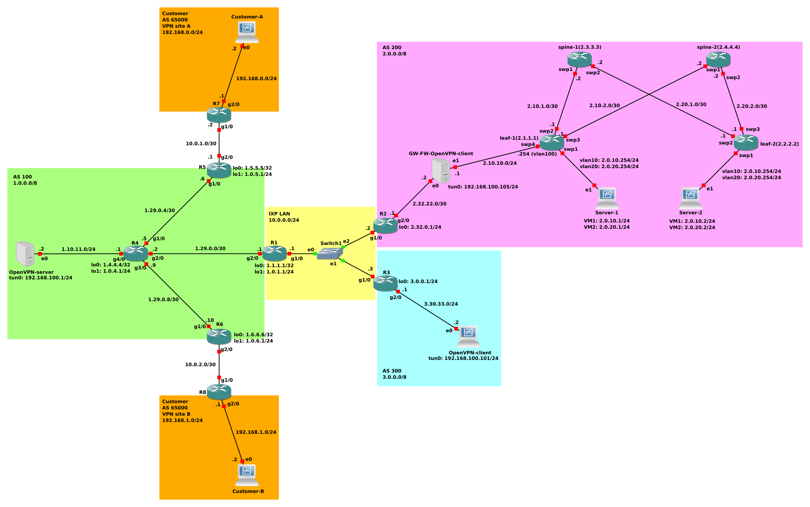

# NSD project (network security) :globe_with_meridians::computer::shield:

__Authors__:

* :man_technologist: Alessandro Chillotti (M. 0299824)
* :man_technologist: Cristiano Cuffaro (M. 0299838)
* :man_technologist: Simone Tiberi (M. 0299908)

## Table of contents

1. [Network topology](#network-topology)
2. [Routers configuration](#routers-configuration)

    1. [Router R1](#router-r1)
    2. [Routers R2 and R3](#routers-r2-and-r3)
    3. [Router R4](#router-r4)
    4. [Routers R5 and R6](#routers-r5-and-r6)
    5. [Routers R7 and R8](#routers-r7-and-r8)
3. [OpenVPN configuration](#openvpn-configuration)

    1. [Certification management](#certification-management)
    2. [Server configuration](#server-configuration)
    3. [Client 1 configuration](#client-1-configuration)
    4. [Client 2 configuration](#client-2-configuration)
4. [EVPN/VXLAN configuration](#evpnvxlan-configuration)
   1. [Spines](#spines)
   2. [Leaves](#leaves)
   3. [Servers](#servers)

5. [Firewall configuration](#firewall-configuration) 
6. [Test cases](#test-cases)

## Network topology

The reference topology for the scripts presented in the following sections is the one shown in the following figure.



## Routers configuration
The configuration scripts for each router inside the topology will be commented on in the following sections.

### Router R1
The IP interfaces were configured as follows:

* a loopback interface used for management purpose (i.e. iBGP configuration):

    ```
    interface Loopback0
    ip address 1.1.1.1 255.255.255.255
    ```

* a loopback interface used to simulate the presence of a host (useful for checking connectivity via `ping`/`traceroute`):

    ```
    interface Loopback1
    ip address 1.0.1.1 255.255.255.0
    ```

* an interface used to link R1 to the IXP LAN:

    ```
    interface GigabitEthernet1/0
    ip address 10.0.0.1 255.255.255.0
    no shutdown
    ```

* an interface used to link R1 to R4:

    ```
    interface GigabitEthernet2/0
    ip address 1.29.0.1 255.255.255.252
    no shutdown
    ```

OSPF has been configured as follows:

* the process has been defined:

    ```
    router ospf 1
    ```

* the identifier for the router has been set, using the `lo0` interface:

    ```
    router-id 1.1.1.1
    ```

* the networks are included inside the process assigned to backbone area (i.e., `area 0`):

    ```
    network 1.1.1.1 0.0.0.0 area 0
    network 1.29.0.0 0.0.0.3 area 0
    network 1.0.1.0 0.0.0.255 area 0
    ```

BGP has been configured as follows:

* for the iBGP peer R1, `next-hop-self` was used to mask the IXP addresses (to avoid DDoS attacks) and also the incoming routes were filtered on the basis of the value of the comunity through a specific `route map comm`:

    ```
    neighbor 1.4.4.4 remote-as 100
    neighbor 1.4.4.4 next-hop-self
    neighbor 1.4.4.4 update-source Loopback0
    neighbor 1.4.4.4 route-map comm in
    ```

* a peer group has been defined to avoid redundancy in the IXP neighbors configuration. In particular, input and output filters have been applied and the community value has been enabled:

    ```
    neighbor ixp-peer peer-group
    neighbor ixp-peer send-community
    neighbor ixp-peer route-map set-local-pref in
    neighbor ixp-peer route-map comm out
    ```

* finally, the prefixes coming in from the IXP peers were filtered:

    ```
    neighbor 10.0.0.2 prefix-list pl-peer200 in
    ! [...]
    neighbor 10.0.0.3 prefix-list pl-peer200 in
    ```

### Routers R2 and R3

Since R2 and R3 have similar configurations, the analysis of only the former is shown below.

The IP interfaces were configured as follows:

* a loopback interface used to simulate the presence of a host connected to the VPN (useful for checking connectivity via `ping`/`traceroute`):

    ```
    interface Loopback0
    ip address 2.0.0.1 255.255.255.0
    ```

* an interface used to reach AS 100:

    ```
    interface GigabitEthernet1/0
    ip address 10.0.0.2 255.255.255.0
    no shutdown
    ```

* an interface used to communicate with the AS 200:

    ```
    interface GigabitEthernet2/0
    ip address 2.20.22.1 255.255.255.0
    no shutdown
    ```

* in order to make the correct advertisement of the prefix 2.0.0.0/8 a static route has also been added:

```
ip route 2.0.0.0 255.0.0.0 null0
```

* as there are no other routers inside the AS it is not necessary to configure OSPF;

* BGP was configured as follows:

    * the local network has been advertised:

        ```
        network 2.0.0.0 mask 255.0.0.0
        ```

    * finally, the prefixes coming in from the IXP peers were filtered:

        ```
        neighbor 10.0.0.1 remote-as 100
        neighbor 10.0.0.1 prefix-list pl-peer100 in
        neighbor 10.0.0.3 remote-as 300
        neighbor 10.0.0.3 prefix-list pl-peer300 in
        ```

### Router R4
The IP interfaces were configured as follows:

* a loopback interface used for management purpose (i.e. iBGP configuration):

    ```
    interface Loopback0
    ip address 1.4.4.4 255.255.255.255
    ```

* a loopback interface used to simulate the presence of a host (useful for checking connectivity via `ping`/`traceroute`):

    ```
    interface Loopback1
    ip address 1.0.4.1 255.255.255.0
    ```

* an interface used to link R4 to R5, where `mpls ip` was used because packets between the two customers pass through this interface:

    ```
    interface GigabitEthernet1/0
    mpls ip
    ip address 1.29.0.5 255.255.255.252
    no shutdown
    ```

* an interface used to link R4 to R1:

    ```
    interface GigabitEthernet2/0
    ip address 1.29.0.2 255.255.255.252
    no shutdown
    ```

* an interface used to link R4 to R6, where `mpls ip` was used because packets between the two customers pass through this interface:

    ```
    interface GigabitEthernet3/0
    mpls ip
    ip address 1.29.0.9 255.255.255.252
    no shutdown
    ```

* an interface used to link R4 to the Open VPN server:

    ```
    interface GigabitEthernet4/0
    ip address 1.10.11.1 255.255.255.0
    no shutdown
    ```

OSPF has been configured as follows:

* the process has been defined:

    ```
    router ospf 1
    ```

* the identifier for the router has been set, using the `lo0` interface:

    ```
    router-id 1.4.4.4
    ```

* the networks are included inside the process assigned to backbone area (i.e., `area 0`):

    ```
    network 1.4.4.4 0.0.0.0 area 0
    network 1.29.0.0 0.0.0.3 area 0
    network 1.29.0.4 0.0.0.3 area 0
    network 1.29.0.8 0.0.0.3 area 0
    network 1.0.4.0 0.0.0.255 area 0
    ```

In order to make the correct advertisement of the prefix 1.0.0.0/9 a static route has also been added:

```
ip route 1.0.0.0 255.128.0.0 null0
```

BGP has been configured as follows:

* the 1.0.0.0/9 network is announced, also associating the community value:

    ```
    network 1.0.0.0 mask 255.128.0.0 route-map comm
    ```

* iBGP configurations with respect to R1, R5 and R6 are similar:

    ```
    neighbor 1.1.1.1 remote-as 100
    neighbor 1.1.1.1 route-reflector-client
    neighbor 1.1.1.1 update-source Loopback0
    neighbor 1.1.1.1 next-hop-self
    neighbor 1.1.1.1 send-community
    neighbor 1.5.5.5 remote-as 100
    neighbor 1.5.5.5 route-reflector-client
    neighbor 1.5.5.5 update-source Loopback0
    neighbor 1.6.6.6 remote-as 100
    neighbor 1.6.6.6 route-reflector-client
    neighbor 1.6.6.6 update-source Loopback0
    ```

    where:

    * towards R1 the community field is enabled to filter the incoming prefixes;

    * `route-reflector-client` is used for R4 to announce to R5 and R6 the routes learned from R1 to 2.0.0.0/8 and 3.0.0.0/8 (see [RFC 4456](https://www.rfc-editor.org/rfc/rfc4456.html) and the answer on [networkengineering.stackexchange.com](https://networkengineering.stackexchange.com/a/44909)).

### Routers R5 and R6

Since R5 and R6 have similar configurations, the analysis of only the former is shown below.

The VRF for the `customers` VPN is defined by specifying route distinguisher and target:

```
ip vrf customers
rd 100:0
route-target export 100:1
route-target import 100:1
```

The IP interfaces were configured as follows:

* a loopback interface used for management purpose (i.e. iBGP configuration):

    ```
    interface Loopback0
    ip address 1.5.5.5 255.255.255.255
    ```

* a loopback interface used to simulate the presence of a host (useful for checking connectivity via `ping`/`traceroute`):

    ```
    interface Loopback1
    ip address 1.0.5.1 255.255.255.0
    ```

* an interface used to link R5 to R4, where `mpls ip` was used because packets between the two customers pass through this interface:

    ```
    interface GigabitEthernet1/0
    mpls ip
    ip address 1.29.0.6 255.255.255.252
    no shutdown
    ```

* an interface used to link R5 to R7, where `ip vrf forwarding customers` was used to enable VRF:

    ```
    interface GigabitEthernet2/0
    ip vrf forwarding customers
    ip address 10.0.1.1 255.255.255.252
    no shutdown
    ```

OSPF has been configured as follows:

* the process has been defined:

    ```
    router ospf 1
    ```

* the identifier for the router has been set, using the `lo0` interface:

    ```
    router-id 1.5.5.5
    ```

* the networks are included inside the process assigned to backbone area (i.e., `area 0`):

    ```
    network 1.5.5.5 0.0.0.0 area 0
    network 1.29.0.4 0.0.0.3 area 0
    network 1.0.5.0 0.0.0.255 area 0
    ```

A static route for VRF forwarding has been added:

```
ip route vrf customers 192.168.0.0 255.255.255.0 10.0.1.2
```

The iBGP relationship with other routers inside the AS are defined:

```
router bgp 100
neighbor 1.4.4.4 remote-as 100
neighbor 1.6.6.6 remote-as 100
neighbor 1.6.6.6 update-source Loopback0
```

VPNV4 peerings is enabled:

```
address-family vpnv4
neighbor 1.6.6.6 activate
neighbor 1.6.6.6 send-community extended
exit-address-family
```

BGP advertisements of VRF are switched on:

```
address-family ipv4 vrf customers
network 192.168.0.0
exit-address-family
```

### Routers R7 and R8

Since R7 and R8 have similar configurations, the analysis of only the former is shown below.

The IP interfaces were configured as follows:

* an interface used to link R7 to R5:

    ```
    interface GigabitEthernet1/0
    ip address 10.0.1.2 255.255.255.252
    no shutdown
    ```

* an interface used to link R7 to the host:

    ```
    interface GigabitEthernet1/0
    ip address 192.168.0.1 255.255.255.0
    no shutdown
    ```

A static route for any packet from any IP address with any subnet mask:

```
ip route 0.0.0.0 0.0.0.0 10.0.1.1
```

## OpenVPN configuration
The overlay OpenVPN is composed by three entities:
- one server that is the host in AS 100;
- two clients:
    - client 1 is the host in AS 300;
    - client 2 is the gateway and firewall in AS 200.

### Certification management
1. Download one of releases of EasyRSA (e.g., `v.3.1.0`):
    ```
    wget https://github.com/OpenVPN/easy-rsa/releases/download/v3.1.0/EasyRSA-3.1.0.tgz && tar xf EasyRSA-3.1.0.tgz && cd EasyRSA-3.1.0/
    ```
2. Initialize easy-rsa and create CA certificate:

    ```
    ./easyrsa init-pki && ./easyrsa build-ca
    ```

2. Generate a certificate and the private key of server:

    ```
    ./easyrsa build-server-full server
    ```
3. Generate certificates and keys for clients:
```
    ./easyrsa build-client-full client1 && ./easyrsa build-client-full client2
```
4. Generate Diffie-Hellman parameters for OpenVPN:
```
./easyrsa gen-dh
```

### Server configuration
The network part of server configuration is the following:
- the following lines to configure the network towards the WAN:
    ```
    ip link set enp0s3 up
    ip addr flush dev enp0s3
    ip addr add 1.10.11.2/24 dev enp0s3
    ip route add default via 1.10.11.1
    ```
- since that the server receives packets not as end point, it must be able to forward packet:
    ```
    echo 1 > /proc/sys/net/ipv4/ip_forward
    ```
The OpenVPN part of server configuration is the following:
- the following lines to set the listening port for the server is 1194, the encapsulation format is udp and the virtual interface is tun:
    ```
    port 1194
    proto udp
    dev tun
    ```
- the following lines to set the path of generated files in the phase of certification management:
    ```
    ca ca.crt
    cert server.crt
    key server.key
    dh dh.pem
    ```
- the following line to tell OpenVPN to run as a server instance and to allocate a 192.168.100.0/24 VPN address range and the servers' virtual adapter has ip 192.168.100.1 beacuse is the first valid ip address:
    ```
    server 192.168.100.0 255.255.255.0
    ```
- the following line tells each client that if they need to send a packet to the 2.0.0.0/11 network they must pass it to the OpenVPN process
    ```
    push "route 2.0.0.0 255.224.0.0"
    ```
- the following line has the same role of previous line, but it is for the server:
    ```
    route 2.0.0.0 255.224.0.0
    ```
- the following line to enable overlay client to client communication through the VPN server:
    ```
    client-to-client
    ```
- the following line to set the path to the per-client specific configuration directory:
    ```
    client-config-dir ccd
    ```
- the following line to tell that the ping every 10 seconds and assume that remote peer is down if no ping received during a 120 second time period:
    ```
    keepalive 10 120
    ```

The content of `ccd` folder is the following:
- a file that assigns ip 192.168.100.101 to client 1 and ip 192.168.100.102 to VPN gateway
    ```
    ifconfig-push 192.168.100.101 192.168.100.102
    ```
- a file that:
    - assigns ip 192.168.100.105 to client 2 and ip 192.168.100.106 to VPN gateway
        ```
        ifconfig-push 192.168.100.105 192.168.100.106
        ```
    - contains the following line because when the server receive one packet with destination ip in 2.0.0.0/11 must be select the tunnel towards the client 2
        ```
        iroute 2.0.0.0 255.224.0.0
        ```

### Client 1 configuration
The network part of server configuration is the following:
```
ip link set enp0s3 up
ip addr flush dev enp0s3
ip addr add 3.30.33.2/24 dev enp0s3
ip route add default via 3.30.33.1
```

The OpenVPN part of client 1 configuration is composed by:
- the following lines to tell that it is a OpenVPN client, the encapsulation format is udp and the virtual interface is tun:
    ```
    client
    proto udp
    dev tun
    ```
- the following lines to set the path of generated files in the phase of certification management:
    ```
    ca ca.crt
    cert client1.crt
    key client1.key
    ```
- the following line to set 1.10.11.2 as server ip address and 1194 as server listening port:
    ```
    remote 1.10.11.2 1194
    ```

### Client 2 configuration
The network part of server configuration is the following:
- the following lines to configure the network towards the WAN:
    ```
    ip link set enp0s3 up
    ip addr flush dev enp0s3
    ip addr add 2.32.22.2/30 dev enp0s3
    ip route add default via 2.32.22.1
    ```
- the following lines to configure the network towards the datacenter:
    ```
    ip link set enp0s8 up
    ip addr flush dev enp0s8
    ip addr add 2.10.10.1/24 dev enp0s8
    ip route add 2.0.0.0/11 via 2.10.10.254
    ```
- since that this client receives packets not as end point, it must be able to forward packet:
    ```
    echo 1 > /proc/sys/net/ipv4/ip_forward
    ```

The OpenVPN part of client 2 configuration is composed by:
- the following lines to tell that it is a OpenVPN client, the encapsulation format is udp and the virtual interface is tun:
    ```
    client
    proto udp
    dev tun
    ```
- the following lines to set the path of generated files in the phase of certification management:
    ```
    ca ca.crt
    cert client2.crt
    key client2.key
    ```
- the following line to set 1.10.11.2 as server ip address and 1194 as server listening port:
    ```
    remote 1.10.11.2 1194
    ```

## EVPN/VXLAN configuration
This section shows the _two-tier leaf-spine Clos topology_ configuration adopted within the datacenter in AS 200. The specification requires:
- EVPN/VXLAN inside the datacenter;
- only one tenant in the datacenter with 2 broadcast domains (vlan 10, vlan 20);
- each server has two VMs belonging to the two broadcast domains;
- vlan 100 between linux gateway and access leaf.

### Spines
The configuration of the two spines is very similar, therefore only the one relating to the spine 1 is considered.

The following commands are used to configure the IP addresses:
```
net add interface swp1 ip add 2.10.1.2/30
net add interface swp2 ip add 2.20.1.2/30
net add loopback lo ip add 2.3.3.3/32
```

OSPF configuration:
```
net add ospf router-id 2.3.3.3
net add ospf network 2.10.1.0/30 area 0
net add ospf network 2.20.1.0/30 area 0
net add ospf network 2.3.3.3/32 area 0
```

Finally, EVPN was configured as a control plane for network virtualization with VXLAN, using the MP-eBGP mechanism in which:
- the spines are placed in the private AS 65000;
- leaf 1 is placed in private AS 65001;
- leaf 2 is placed in private AS 65002.

BGP configuration:
```
net add bgp autonomous-system 65000
net add bgp router-id 2.3.3.3
net add bgp neighbor swp1 remote-as external
net add bgp neighbor swp2 remote-as external
```
Activation of the BGP EVPN extension:
```
net add bgp evpn neighbor swp1 activate
net add bgp evpn neighbor swp2 activate
```

For spine 2 just change the IP addresses to those shown in the [reference topology](#network-topology).

### Leaves
Below is the configuration of leaf 2 because, except for the addresses, it is also valid for leaf 1, with the difference that the latter constitutes the access leaf and therefore has additional configurations.

> **Note:** the VXLAN network interfaces `vni-10` and `vni-20` are L2VNI, each associated with one broadcast domain of the tenant, while the `vni-1020` is the VNI associated with the tenant for layer 3 routing across different subnets.

Creation the VXLAN interfaces:
```
net add vxlan vni-10 vxlan id 10
net add vxlan vni-20 vxlan id 20
net add vxlan vni-1020 vxlan id 1020
```

Creation of a VLAN-aware bridge that contains one switch port and the VXLAN interfaces, also includes 3 VLANs:
```
net add bridge bridge ports vni-10,vni-20,swp1,vni-1020
net add bridge bridge vids 10,20,50
net add bridge bridge vlan-aware
```
this actually bridge the packets from the VLAN interfaces to the VXLAN tunnels.

Adding the point-to-point addresses and the loopback address:
```
net add interface swp2 ip add 2.20.1.1/30
net add interface swp3 ip add 2.20.2.1/30
net add loopback lo ip add 2.2.2.2/32
```

OSPF configuration:
```
net add ospf router-id 2.2.2.2
net add ospf network 2.20.1.0/30 area 0
net add ospf network 2.20.2.0/30 area 0
net add ospf network 2.2.2.2/32 area 0
net add ospf passive-interface swp1
```

Local-tunnel IP specification (so the source IP in the outer header of the VXLANs) and bridge instruction to create a mapping such that all packets tagged with a VLAN ID go into the corresponding VXLAN tunnel:
```
net add vxlan vni-10 vxlan local-tunnelip 2.2.2.2
net add vxlan vni-10 bridge access 10
net add vxlan vni-20 vxlan local-tunnelip 2.2.2.2
net add vxlan vni-20 bridge access 20
```

Adding VLANs and their IP addresses:
```
net add vlan 10 ip address 2.0.10.254/24
net add vlan 20 ip address 2.0.20.254/24
```

BGP configuration:
```
net add bgp autonomous-system 65002
net add bgp router-id 2.2.2.2
net add bgp neighbor swp2 remote-as 65000
net add bgp neighbor swp3 remote-as 65000
```
Activation of the BGP EVPN extension and export of VNI routes:
```
net add bgp evpn neighbor swp2 activate
net add bgp evpn neighbor swp3 activate
net add bgp evpn advertise-all-vni
```

Finally, to actually configure the L3VNI it is necessary to add another VLAN used only to bridge packets that enter an L2VNI and must exit through the L3VNI, so it is only a binding between a VLAN ID and an L3VNI:
```
net add vlan 50
net add vxlan vni-1020 vxlan local-tunnelip 2.2.2.2
net add vxlan vni-1020 bridge access 50
```
Configure the VRF to L3VNI mapping:
```
net add vrf TEN1 vni 1020
```
Configure the switch virtual interfaces for the L3VNI:
```
net add vlan 50 vrf TEN1
net add vlan 10 vrf TEN1
net add vlan 20 vrf TEN1
```

For leaf 1 just change the IP addresses and the AS number to those shown in the [reference topology](#network-topology).

#### Access leaf
Since leaf 1 is the access leaf for the datacenter, it requires additional configuration.

First of all, with the commands already shown above the VLAN 100 was added to communicate with the gateway and the corresponding L2VNI has also been created for the same tenant, so that packets from outside can be routed thanks to the L3VNI.

Since the swp4 interface must receive packets from only one VLAN, with the following command it has been configured as an access port:
```
net add interface swp4 bridge access 100
```
EVPN in Cumulus Linux supports prefix-based routing using EVPN type-5 (prefix) routes. Type-5 routes (or prefix routes) are primarily used to route to destinations outside of the datacenter fabric.

The following commands are required in the tenant VRF to announce IP prefixes in the BGP RIB as EVPN type-5 routes:
```
net add bgp vrf TEN1 autonomous-system 65001
net add bgp vrf TEN1 l2vpn evpn advertise ipv4 unicast
```
The following command permits to originate a default type-5 route in EVPN, so that any leaf within the datacenter follows the default route towards the access leaf for all external traffic (towards the WAN):
```
net add bgp vrf TEN1 l2vpn evpn default-originate ipv4
```
Finally, setting the gateway IP address for VLAN 100:
```
net add vlan 100 ip gateway 2.10.10.1
```

### Servers
The VMs were emulated by creating namespaces and adding different VLAN interfaces for each namespace.

The configuration of the two servers is very similar, therefore only the one relating to the server 1 is considered.

Creation of network namespaces:
```
ip netns add subA
ip netns add subB
```
The following commands are for creating VLAN interfaces inside the network namespaces:
```
ip link add link enp0s8 name enp0s8.10 type vlan id 10
ip link add link enp0s8 name enp0s8.20 type vlan id 20
ip link set enp0s8.10 netns subA
ip link set enp0s8.20 netns subB
```
Assigning IP addresses and making the network interfaces up:
```
ip netns exec subA ip addr add 2.0.10.1/24 dev enp0s8.10
ip netns exec subB ip addr add 2.0.20.1/24 dev enp0s8.20
ip link set enp0s8 up
ip netns exec subA ip link set enp0s8.10 up
ip netns exec subB ip link set enp0s8.20 up
```
Adding default routes:
```
ip netns exec subA ip route add default via 2.0.10.254
ip netns exec subB ip route add default via 2.0.20.254
```
For server 2 just change the IP addresses to those shown in the [reference topology](#network-topology).

## Firewall configuration

The firewall configuration is implemented in the host in AS 200 and it has the following content:
- the following line to flush the rules:
    ```
    iptables -F
    ```
- the following lines to set the default policies as DROP for INPUT, OUTPUT and FORWARD:
    ```
    iptables -P FORWARD DROP
    iptables -P INPUT DROP
    iptables -P OUTPUT DROP
    ```
- the forward chain is the following:
    - the following rule allow to forward packet from enp0s8 (interface to VXLAN) to tun0 (tunnel to WAN) when the destination ip is 1.10.11.2 (ip of OpenVPN server)
        ```
        iptables -A FORWARD -i enp0s8 -d 1.10.11.2 -p udp --dport 1194 -o tun0 -j ACCEPT
        ```
    - the following rule allow to forward packet from tun0 (tunnel to WAN) to enp0s8 (interface to VXLAN) when the source ip is 1.10.11.2 (ip of OpenVPN server)
        ```
        iptables -A FORWARD -i tun0 -s 1.10.11.2 -p udp --sport 1194 -o enp0s8 -j ACCEPT
        ```
    - the following rules allow to forward ICMP packets from enp0s8 (interface to VXLAN) and tun0 (tunnel to WAN) and viceversa
        ```
        iptables -A FORWARD -i enp0s8 -p icmp -o tun0 -j ACCEPT
        iptables -A FORWARD -i tun0 -p icmp -o enp0s8 -j ACCEPT
        ```
- the input chain is the following:
    - the following rule allow to receive in input from the enp0s3 (interface to WAN) packet with source ip 1.10.11.2 and port number 1194
        ```
        iptables -A INPUT -i enp0s3 -s 1.10.11.2 -p udp --sport 1194 -j ACCEPT
        ```
        __Remark__: this rule is important to establish connection
    - the following rules allow to receive in input ICMP packets from enp0s8 (interface to VXLAN) and tun0 (tunnel to WAN)
        ```
        iptables -A INPUT -i enp0s8 -p icmp -j ACCEPT
        iptables -A INPUT -i tun0 -p icmp -j ACCEPT
        ```
- the output chain:
    - the following rule allow to send in output to the enp0s3 (interface to WAN) packet with destination ip 1.10.11.2 and port number 1194
        ```
        iptables -A OUTPUT -o enp0s3 -d 1.10.11.2 -p udp --dport 1194 -j ACCEPT
        ```
        __Remark__: this rule is important to establish connection
    - the following rules allow to send in output ICMP packets from enp0s8 (interface to VXLAN) and tun0 (tunnel to WAN)
        ```
        iptables -A OUTPUT -p icmp -o enp0s8 -j ACCEPT
        iptables -A OUTPUT -p icmp -o tun0 -j ACCEPT
        ```

## Test cases

### BGP/MPLS VPN

1. examine MPLS forwarding table on R5/R6 (_there should be VPNs configured_):

    ```
    show mpls forwarding-table
    ```

2. examine the routes associated with VPN A on R5/R6

    ```
    show ip route vrf customers
    ```

3. configure the customer hosts using the `scripts/hosts/setup_customer.sh` script with sudo privileges as follows:

    * on `customer-A`:

        ```
        /path/to/setup_customers.sh 192.168.0.2 192.168.0.1
        ```

    * on `customer-B`:

        ```
        /path/to/setup_customers.sh 192.168.1.2 192.168.1.1
        ```

    and then verify the connectivity using;

    ```
    ping 192.168.X.2 # where x is 1 if executed on customer-a and 0 otherwise
    ```

### Overlay OpenVPN

The test cases for overlay OpenVPN are represented ping between the overlay entities. An example, on client 1:

- ping the server:
    ``` 
    ping 192.168.100.1
    ```
- ping the client 2:
    ``` 
    ping 192.168.100.105
    ```
- ping one host in datacenter:
    ``` 
    ping 2.0.10.1
    ```
In addition, Wireshark can be used to analyze the correct behavior of overlay OpenVPN.

### EVPN/VXLAN

1. examine the number of remote VTEPs for each VNI from the leaves (_it should be different from 0 for VNI 10 and VNI 20_):
    ```
    net show evpn vni
    ```
2. for each VNI, check the correct type (e.g. _L2 for VNI 10 and L3 for VNI 1020_) with the previous command or seeing the VXLAN encapsulation through Wireshark capture of packets sent to the same and different broadcast domains;
3. check the presence of the default type-5 route in the BGP RIB of the leves:
    ```
    net show bgp evpn route
    ```
4. simulates VM migration by removing current links between servers and leaves and reconnecting but swapped (_seamless migration: automatically EVPN should exchange the information of this migrated VMs, e.g. advertises the change of MAC addresses_).