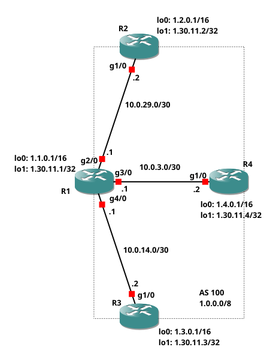

# NSD project (network security) :globe_with_meridians::computer::shield:

__Authors__:

* :man_technologist: Alessandro Chillotti (M. 0299824)
* :man_technologist: Cristiano Cuffaro (M. 0299838)
* :man_technologist: Simone Tiberi (M. 0299908)

## Table of contents

1. [Network topology](#network-topology)
2. [Routers configuration](#routers-configuration)

    1. [Router R1](#router-r1)
    2. [Routers R2 and R3](#routers-r2-and-r3)

## Network topology

The reference topology for the scripts presented in the following sections is the one shown in the following figure.



## Routers configuration
The configuration scripts for each router inside the topology will be commented on in the following sections.

### Router R1
The IP interfaces were configured as follows:

- a loopback interface to simulate the presence of a host (useful for checking connectivity via `ping`/`traceroute`):

    ```
    interface Loopback0
    ip address 1.0.1.1 255.255.255.0
    ```
- an interface to link R1 to the IXP LAN:

    ```
    interface GigabitEthernet1/0
    ip address 10.0.0.1 255.255.255.0
    no shutdown
    ```

- an interface to link R1 to R4:

    ```
    interface GigabitEthernet2/0
    ip address 1.96.0.1 255.255.255.252
    no shutdown
    ```

OSPF has been configured as follows:

* the process has been defined:

    ```
    router ospf 1
    ```

* the two networks (i.e., `lo0` and `g2/0`) are included inside the process assigned to backbone area (i.e., `area 0`):

    ```
    network 1.96.0.0 0.0.0.3 area 0
    network 1.0.1.0 0.0.0.255 area 0
    ```

Finally BGP has been configured as follows:

* for the iBGP peer R1 `next-hop-self` was used to mask the IXP addresses (to avoid DDoS attacks) and also the incoming routes were filtered on the basis of the value of the comunity through a specific `route map comm`:

    ```
    neighbor 1.96.0.2 remote-as 100
    neighbor 1.96.0.2 next-hop-self
    neighbor 1.96.0.2 route-map comm in
    ```
* a peer group has been defined to avoid redundancy in the IXP neighbors configuration. In particular, input and output filters have been applied and the community value has been enabled:

    ```
    neighbor ixp-peer peer-group
    neighbor ixp-peer send-community
    neighbor ixp-peer route-map set-local-pref in
    neighbor ixp-peer route-map comm out
    ```

* finally, the prefixes coming in from the IXP peers were filtered:

    ```
    neighbor 10.0.0.X prefix-list pl-peerX00 in
    ```

### Routers R2 and R3

R2 and R3 routers have a simpler setup:

* the IP interfaces were configured as showed before:

    ```
    interface Loopback0
    ip address 2.0.0.1 255.0.0.0
    !
    interface GigabitEthernet1/0
    ip address 10.0.0.2 255.255.255.0
    no shutdown
    ```
* as there are no other routers inside the AS it is not necessary to configure OSPF;
* BGP was configured similarly to router 1:

    * the local network has been advertised:

        ```
        network X.0.0.0 mask 255.0.0.0
        ```

    * finally, the prefixes coming in from the IXP peers were filtered:

        ```
        neighbor 10.0.0.X remote-as X00
        neighbor 10.0.0.X prefix-list pl-peerX00 in
        ```
